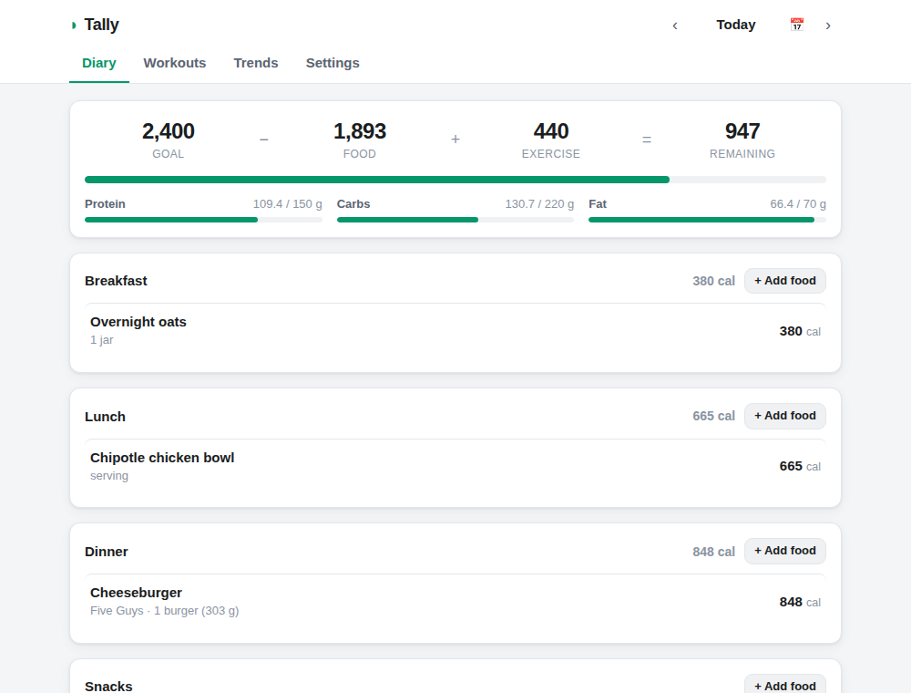

# Tally — Calorie & Workout Tracker

A lightweight, local-first desktop app for tracking what you eat and how you train.
Built with Tauri; the frontend is plain HTML/CSS/JS and also runs in any browser.



## Features

**Food diary**
- Log foods to Breakfast / Lunch / Dinner / Snacks with a serving multiplier
- Daily budget: goal − food + exercise = remaining, plus protein/carbs/fat progress
- Search real food databases (restaurants, brands, generics — see below)
- Custom foods, recent foods, and one-tap Quick Add (calories + optional macros)

**Workouts**
- Strength: exercise, sets × reps × weight (lb/kg), auto volume total
- Cardio: activity, duration, optional distance
- Optional calories burned, credited back to your daily budget (toggleable)
- Exercise-name autocomplete from your own history

**Trends**
- 14-day calorie chart vs. your goal, workout counts, averages

**Your data stays yours**
- Everything is stored locally (browser/webview localStorage) — no account, no server
- One-click JSON export/import for backups

## Food databases

MyFitnessPal's database isn't publicly available (their API is closed), so Tally
plugs into open databases instead. Enable any mix in **Settings → Food databases**;
results are searched together:

| Source | Coverage | Key needed? |
|--------|----------|-------------|
| **USDA FoodData Central** | Generic foods + branded groceries | Works out of the box via `DEMO_KEY` (shared rate limit). Free personal key at [api.data.gov/signup](https://api.data.gov/signup/) |
| **Nutritionix** | Best for restaurant & chain menu items (McDonald's, Chipotle, …) | Free App ID + Key at [developer.nutritionix.com](https://developer.nutritionix.com) |
| **Open Food Facts** | Community database of packaged foods | None |

## Getting started

```bash
npm install
npm run tauri:dev     # desktop app with hot reload (requires Rust toolchain)
npm run dev:web       # or: run the frontend in your browser at localhost:5173
npm run tauri:build   # production desktop build
```

## Development

```bash
npm test              # unit tests (node:test, Node 20+)
```

- `src/` — frontend. `js/store.js` (persistence), `js/nutrition.js` (math),
  `js/providers.js` (food APIs) are pure modules covered by unit tests;
  `js/app.js` is the UI layer.
- `src-tauri/` — minimal Tauri shell (no custom Rust commands).
- `tests/` — `node --test` suites with API response fixtures.

> **Note:** the app icons in `src-tauri/icons/` are inherited from this repo's
> previous life as a markdown viewer and are worth replacing.
